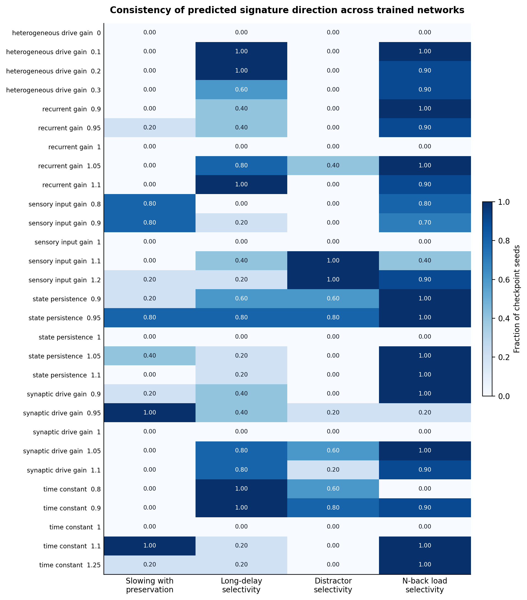
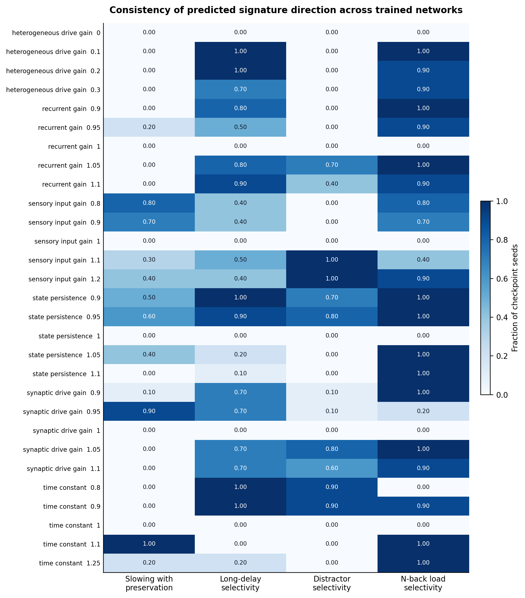
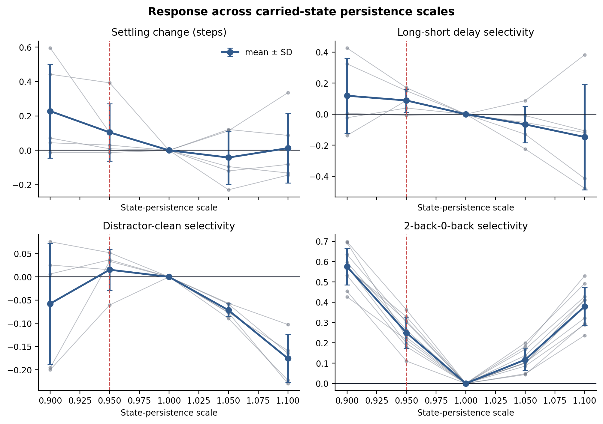
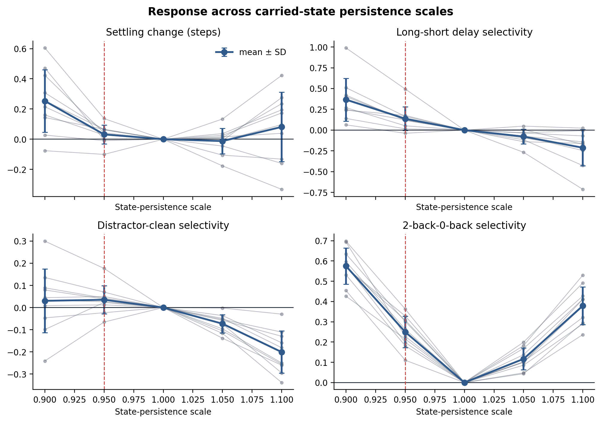
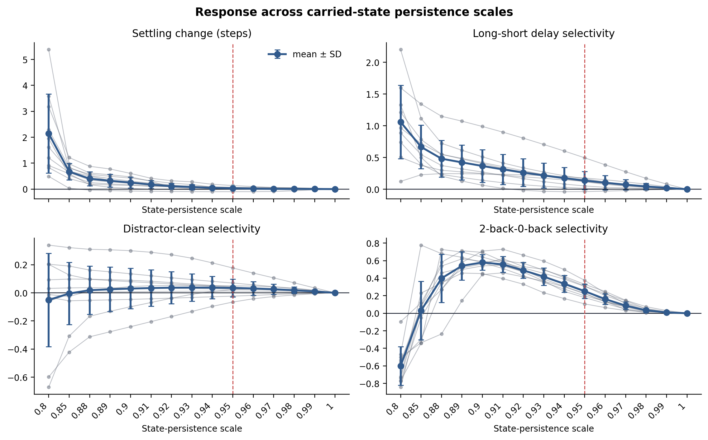

# Old and new perturbation figures

## Cross-task signature screen

| Old: 5 circular seeds, midpoint distractor | New: 10 circular seeds, variable-timing distractor |
|---|---|
|  |  |

At state persistence `0.95`, circular agreement changed from `4/5` on all
three circular measures to `6/10` for slowing with preservation, `9/10` for
delay selectivity, and `8/10` for randomized-timing distractor selectivity.
N-back load agreement remained `10/10`.

## Seed-level state-persistence response

| Old: 5 circular seed trajectories | New: 10 circular seed trajectories |
|---|---|
|  |  |

Mean contrasts at state persistence `0.95`:

| Measure | Old | New |
|---|---:|---:|
| Settling change | `+0.104` steps | `+0.032` steps |
| Long-minus-short delay selectivity | `+0.089` | `+0.137` |
| Distractor-minus-clean selectivity | `+0.015` | `+0.035` |
| N-back load selectivity | `+0.250` | `+0.250` |

## Dense persistence neighbourhood

Same 10 circular and 10 N-back checkpoints, persistence-only grid
`0.80`, `0.85`, then `0.88`--`1.00` in steps of `0.01`.

Selected strengths:

| Persistence | Settling mean | Slowing+preservation | Delay + | Distractor + | N-back load mean | N-back + |
|---|---:|---:|---:|---:|---:|---:|
| `0.80` | `+2.143` | `1/10` | `10/10` | `5/10` | `-0.601` | `0/10` |
| `0.90` | `+0.253` | `5/10` | `10/10` | `7/10` | `+0.579` | `10/10` |
| `0.95` | `+0.032` | `6/10` | `9/10` | `8/10` | `+0.251` | `10/10` |
| `0.96` | `+0.019` | `7/10` | `9/10` | `8/10` | `+0.161` | `10/10` |
| `1.00` | `+0.000` | `0/10` | `0/10` | `0/10` | `+0.000` | `0/10` |

Stronger cuts (`0.80`) increase settling but break clean preservation and
invert N-back load selectivity. The neighbourhood around `0.94`--`0.96`
retains the descriptive circular majority pattern with weaker settling than
the deep low-persistence regime.
